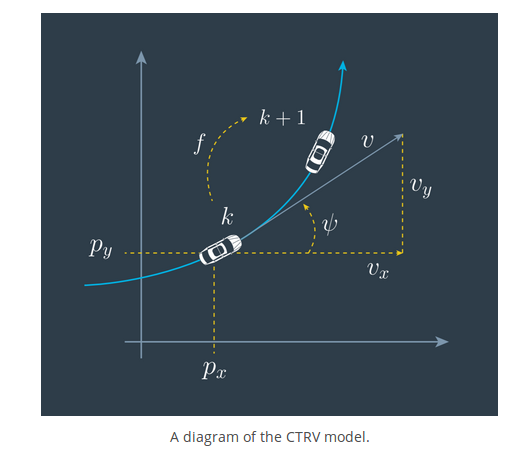

### Project member: Cuiqing Li

### Date: June 2017

# Unscented Kalman Filter Project

### A final result demo of this project:
In this demo, the car can predict its position corrently based on Unscented Kalman fileter using the implemented algorithms. In this demo, the green dots represent the predicted location of every second, and the colorful dots are measurement points of the car from resource of radar and lidar. 


### Description of The Project
In this project utilize an Unscented Kalman Filter to estimate the state of a moving object of interest with noisy lidar and radar measurements. Passing the project requires obtaining RMSE values that are lower that the tolerance outlined in the project reburic. 

This project involves the Term 2 Simulator which can be downloaded [here](https://github.com/udacity/self-driving-car-sim/releases)

This repository includes two files that can be used to set up and intall [uWebSocketIO](https://github.com/uWebSockets/uWebSockets) for either Linux or Mac systems. For windows you can use either Docker, VMware, or even [Windows 10 Bash on Ubuntu](https://www.howtogeek.com/249966/how-to-install-and-use-the-linux-bash-shell-on-windows-10/) to install uWebSocketIO. 

Once the install for uWebSocketIO is complete, the main program can be built and ran by doing the following from the project top directory.
```
1. mkdir build
2. cd build
3. cmake ..
4. make
5. ./UnscentedKF
```
Note that the programs that need to be written to accomplish the project are src/ukf.cpp, src/ukf.h, tools.cpp, and tools.h

Here is the main protcol that main.cpp uses for uWebSocketIO in communicating with the simulator.

INPUT: values provided by the simulator to the c++ program

```
["sensor_measurement"] => the measurment that the simulator observed (either lidar or radar)
```

OUTPUT: values provided by the c++ program to the simulator
```
["estimate_x"] <= kalman filter estimated position x
["estimate_y"] <= kalman filter estimated position y
["rmse_x"]
["rmse_y"]
["rmse_vx"]
["rmse_vy"]
```

### A picture display CTRV model we used in this project:
 

### Other Important Dependencies

* cmake >= v3.5
* make >= v4.1
* gcc/g++ >= v5.4

## Basic Build Instructions

1. Clone this repo.
2. Make a build directory: `mkdir build && cd build`
3. Compile: `cmake .. && make`
4. Run it: `./UnscentedKF path/to/input.txt path/to/output.txt`. You can find
   some sample inputs in 'data/'.
    - eg. `./UnscentedKF ../data/obj_pose-laser-radar-synthetic-input.txt`


